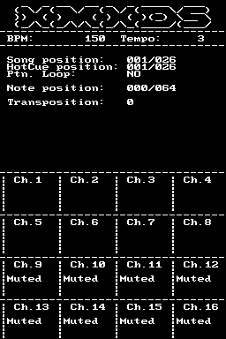

# MAXMXDS
## .MAS DJ deck for Nintendo DS



MAXMXDS (**MAX**mod **M**i**X** software for **DS**) is a DJ-style tracker module player for Nintendo DS homebrew. 
It is built on the ashes of XMXDS as an improved version. 

It plays .mas files (converted from XM/MOD/IT/S3M via mmutil) with real-time performance controls, 32-channel software mixing, and demoscene visualizers.

Inspired by PT-1210 for Amiga. Uses [blocksds's fork of MaxMod](https://github.com/blocksds/maxmod) as sound engine (Mode-C software mixer on ARM7).

Works with both real hardware (flashcarts) and emulators. File navigation on hardware requires FAT filesystem access. Alternatively, emulator builds can embed songs at compile time (NitroFS).

Distributed under MIT license.

## Features

- 32-channel software mixing with per-channel mute/solo
- BPM control with lock, nudge, and tap tempo
- 8 cue points (touch) + 1 hot cue (buttons) with jump and set
- Rolling loop with quantized divisions (4/8/16/32/64/128 rows)
- Beat-synced stutter (rhythmic volume gate)
- Semitone transpose (+-12)
- Pattern loop mode
- Per-channel oscilloscope waveforms
- Audio-reactive visualizers

## Controls

### Playback
| Input | Action |
|---|---|
| A | Play / Stop |
| UP / DOWN | BPM +1 / -1 |
| LEFT / RIGHT | Nudge tempo (+-4% while held) |
| START | Toggle BPM lock |
| X | Toggle pattern loop |

### Cue / Transport
| Input | Action |
|---|---|
| B | Set hot cue to current position |
| B + LEFT/RIGHT | Move hot cue -1 / +1 |
| Y (release) | Jump to hot cue (at pattern end) |
| L / R | Transpose down / up (semitone) |

### DJ Effects
| Input | Action |
|---|---|
| SELECT + UP | Toggle rolling loop |
| SELECT + LEFT/RIGHT | Halve / double loop division |
| SELECT + DOWN | Toggle beat stutter |

### Navigation
| Input | Action |
|---|---|
| SELECT + START | Open file browser |

## Bottom Screen

Touch the tab strip to switch between three modes:

- **CH** — 8x4 channel oscilloscope grid. Touch top half of a cell to mute, bottom half to solo.
- **CUE** — 8 cue point buttons (top=jump, bottom=set) and a tap tempo zone.
- **VFX** — Visualizer effect selector (8 effects) with SIZE and GAP sliders.

## Converting Songs

MAXMXDS plays .mas files. Convert with mmutil:

```
mmutil -d -y -m mysong.xm -omysong.mas
```

Batch convert:

```
python scripts/mas.py -i /path/to/songs -o data
```

## Building

Requires [devkitPro](https://devkitpro.org/) (devkitARM + libnds).

```
cd source
make
```

Output: `release/MAXMXDS.nds`
